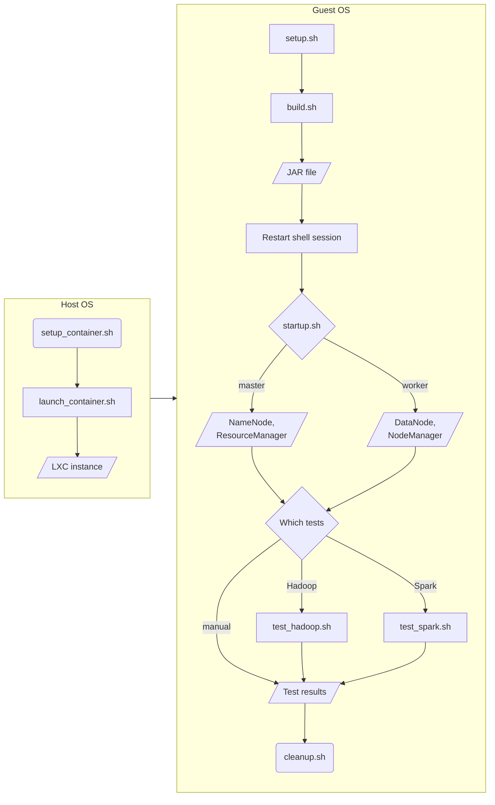

<script
  type="text/javascript"
  src="http://cdn.mathjax.org/mathjax/latest/MathJax.js?config=TeX-AMS-MML_HTMLorMML">
</script>
<script type="text/x-mathjax-config">
  MathJax.Hub.Config({
    tex2jax: {inlineMath: [['$', '$']]},
    messageStyle: "none",
  });
</script>

# [Homework 5](https://github.com/hanggrian/IIT-CS553/blob/assets/assignments/hw5.pdf): Report

> This programming assignment covers hashgen, sort, and search through Hadoop
  and Spark on multiple nodes. You must use a [Chameleon](https://www.chameleoncloud.org)
  node using Bare Metal Provisioning. You must deploy Ubuntu Linux 24.04 using
  "compute-skylake" nodes; other instance types can be used if no Skylake nodes
  are available. Once you create a lease (up to 7 days are allowed), and start
  your 1 physical node, and Linux boots, you will find yourself with a physical
  node with 24 CPU cores, 48 hardware threads, 128GB of memory, and 250GB SSD
  hard drive. You will install your favorite virtualization tools (e.g.
  virtualbox, LXD/KVM, qemu), and use it to deploy three different type of VMs
  with the following sizes: `tiny.instance` (4-cores, 4GB ram, 10GB disk),
  `small.instance` (4-cores, 4GB ram, 30GB disk), and `large.instance`
  (32-cores, 32GB ram, 240GB disk).
>
> This assignment will be broken down into several parts, as outlined below:
>
> **Hadoop File System and Hadoop Install:** Download, install, configure, and
  start the HDFS system (that is part of [Hadoop](https://hadoop.apache.org)) on
  a virtual cluster with 1 `large.instance` + 1 `tiny.instance`, and then again
  on a virtual cluster with 8 `small.instance`s + 1 `tiny.instance`. You must
  set replication to 1 (instead of the default 3), or you won't have enough
  storage capacity to conduct your experiments on the 64GB dataset.
>
> **Datasets:** Once HDFS is operational, you must generate your dataset. Since;
  you will create 3 workloads: data-16GB.bin, data-32GB.bin, and data-64GB.bin,
  for K=30, K=31, and K=32. You may not have enough room to store them all, and
  run your compute workloads. Make sure to cleanup after each run. Remember that
  you will typically need 3X the storage, as you have the original input data
  (1x), temporary data (1x), and output data (1x). Configure Hadoop to run on
  the virtual cluster, on 1 `large.instance` + 1 `tiny.instance` as well as the
  separate installation on 6 `small.instance`s + 1 `tiny.instance`. The
  `tiny.instance` will run parts of Hadoop (e.g. name node, scheduler, etc).
>
> **Spark Install:** Download, install, configure, and start [Spark](https://spark.apache.org).
  Note that you will need the HDFS installation for Hadoop to work from and to.
>
> **Hashgen:** Run the hashgen you implemented in HW4 on the `small.instance`
  and `large.instance` defined above on the 16GB, 32GB, and 64 GB datasets
  respectively. If you don't have a working version, write a paragraph about why
  you could not complete the hashgen implementation, even a simple version that
  sequentially generated the hashes and then sequentially sorted them. A naïve
  implementation of hashgen should have been possible in 100 lines of code or
  less with a few hours of work. Detail your issues with why you could not
  accomplish this.
>
> **Vault:** Run the vault provided in your repo on the `small.instance` and
  `large.instance` defined above on the 16GB, 32GB, and 64 GB datasets
  respectively. You can use the following commands:
>
> - 16GB dataset with 2GB RAM:
>
>   ```
>   ./vaultx -t 32 -i 1 -m 2048 -k 30 -g data-16GB.tmp -f data-16GB.bin
>   ```
> - 64GB dataset with 16GB RAM:
>
>   ```
>   ./vaultx -t 32 -i 1 -m 16384 -k 32 -g data-64GB.tmp -f data-64GB.bin
>   ```
> - You can verify the data was generated correctly with:
>
>   ```
>   ./vaultx -f data-64GB.bin -v true
>   ```
>
> **Hadoop Hashgen/Sort:** Implement the HadoopSort application (you can use
  Java, Python, or SCALA). You must generate Blake3 hashes to be stored in HDFS.
  You can use any Blake3 libraries for this assignment. Here are some good
  libraries for Java and Python. You can use Class Blake3 in the package
  [`org.apache.commons.codec.digest`](https://commons.apache.org/proper/commons-codec/apidocs/org/apache/commons/codec/digest/Blake3.html). For Python, you can use the Python bindings for the Rust
  blake3 [crate](https://pypi.org/project/blake3/). For SCALA, you can use the
  optimized blake3 [implementation](https://index.scala-lang.org/catap/scala-blake3)
  for scala, scala-js and scala-native. You must retrieve a 10-byte hash from
  Blake3 using a 6-byte NONCE input (generate random for each invocation). The
  final value to write into HDFS should be a 16-byte value (10-byte hash
  followed by 6-byte NONCE). You must specify the number of reducers to ensure
  you use all the resources of the 6-node cluster. You must generate the data,
  store it on HDFS, then read it back from HDFS, sort it, and then store the
  sorted data in HDFS and validate it. Measure the time from beginning to end,
  including hash generation, writing to HDFS, reading from HDFS, sorting, and
  writing the final result to HDFS; do not include the time to verify the data
  has been sorted correctly.
>
> **Hadoop Verify:** Implement a verification program that reads the data from
  HDFS and verifies that it has been sorted. This can be a simple Java/Python
  program that can read HDFS and sequentially verify the data is sorted.
>
> **Spark Sort:** Implement the SparkSort application. Make sure to use RDD to
  speed up the sort through in-memory computing. You must generate the hashes,
  write them to HDFS, read the data back from HDFS, make use of RDD, sort, and
  write the sorted data back to HDFS, and finally validate the sorted data with
  valsort. Measure the time from hash generation all the way to writing the
  sorted data back to; do not include the time to validate the sorted data.



The benchmarking process requires several containers of different
specifications. To launch a container, run `setup_container.sh` to prepare LXC
and generate an SSH key pair for passwordless connections between containers.
Then, run `launch_container.sh`, specifying the desired specifications (**tiny,
small,** or **large**).


Next, install Hadoop and Spark inside the guest OS by running `setup.sh`. This
script will also provide the necessary environment variables. For this reason, a
shell session must be restarted before continuing to the next step. Using the
[Shadow Gradle plugin](https://gradleup.com/shadow/), the `build.sh` script
compiles the fat JAR file with Blake3 dependencies needed for Hadoop and Spark
jobs.

The Spark application sorts data using resilient distributed datasets (RDD)
transformations, which generate hashes across partitions in memory. On the
other hand, the Hadoop application relies on `MapReduce` techniques to process
data stored on HDFS. Both implementations utilize the Blake3 hashing algorithm
provided by the Apache Commons Codec library.


Having prepared the binaries, the `startup.sh` script prompts the user for the
role of the current container. The **master** node should run the script last,
after all **workers** are online. The script distributes XML configuration files
and the generated SSH keys to all nodes.


With the cluster set up, test the implementations by running `test_hadoop.sh` or
`test_spark.sh`, which perform minimal benchmarks to verify correctness. The
actual benchmarking scripts must be run manually with `time hadoop jar` or
`time spark-submit`. Sample commands are shown in the test scripts.


Finally, clean up the cluster by running `cleanup.sh` to save resources. This
stops all daemons gracefully.


## Problem 1

> **Performance:** Compare the performance of your own hashgen (from HW4), the
  vaultx provided by the professor, Hadoop Sort, and Spark Sort on a 8-node
  cluster with the 16GB, 32GB, and 64GB datasets. Fill in the table below, and
  then derive new tables or figures (if needed) to explain the results. Your
  time should be reported in seconds.
>
> Some of the things that will be interesting to explain are: how many threads,
  mappers, reducers, you used in each experiment; how many times did you have to
  read and write the dataset for each experiment; what speedup and efficiency
  did you achieve?
>
> For the 64GB workload, monitor the disk I/O speed (in MB/sec), memory
  utilization (GB), and processor utilization (%) as a function of time, and
  generate a plot for the entire experiment. Here is an example of a plot that
  has cpu utilization and memory utilization.
>
>    width="240px"
>   alt="Example CPU and memory utilization"
>   src="https://i.stack.imgur.com/dmYAB.png"/>
>
> Plot a similar looking graph but with the disk I/O data as well as a 3rd line.
  Do this for both shared memory benchmark (your code) and for the Linux Sort.
  You might find some [online info](https://unix.stackexchange.com/questions/554/how-to-monitor-cpu-memory-usage-of-a-single-process)
  useful on how to monitor this type of information. For multiple instances, you
  will need to combine your monitor data to get an aggregate view of resource
  usage. Do this for all four versions of your sort. After you have all six
  graphs (2 system configuratiozns [`small.instance` and `large.instance`] and 4
  different sort techniques), discuss the differences you see, which might
  explain the difference in performance you get between the two implementations.
  Make sure your data is not cached in the OS memory before you run your
  experiments.
>
> Note that you can set the memory limit to be 2GB for the `small.instance` and
  16GB for the `large.instance`. What conclusions can you draw? Which seems to
  be best at 1 node scale (1 `large.instance`)? Is there a difference between 1
  `small.instance` and 1 `large.instance`? How about 8 nodes (8
  `small.instance`)? What speedup do you achieve with strong scaling between 1
  to 8 nodes? What speedup do you achieve with weak scaling between 1 to 8 nodes
  (you may need to run K=29 on 1 `small.instance`, and compare to K=32 on 8
  `small.instance`)? How many `small.instance`s do you need with Hadoop to
  achieve the same level of performance as your hashgen or vaultx programs? How
  about how many `small.instance`s do you need with Spark to achieve the same
  level of performance as you did with your hashgen/vault? Does Spark seem to
  offer any advantages over Hadoop for this application? Can you predict which
  would be best if you had 100 `small.instance`s? How about 1000?
>
> Complete Table 1 outlined below. Perform the experiments outlined above, and
  complete the following table:

On a large instance, the `vaultx` binary crashed on datasets of 32GB and above
in my testing. In the figure generated by GNU plot, the memory is seen spiking
at 200 seconds, which is when the crash occurred.


The current fix is to reduce the max memory usage in `-m` flag (1.5GB in
`small.instance` and 12GB in `large.instance`). All other experiments will
follow this configuration. In the example below, `large.instance` has
successfully completed the 64GB dataset benchmark using 12GB of RAM.


CPU and memory utilization over time of `hashgen` looks similar to that of
`vaultx`. However, I do notice that vaultx consistently writes and dumps RAM
towards the end of the execution.


Unfortunately, Hadoop and Spark jobs fail on 64GB datasets due to persistent
freezing in the `hadoop` and `spark-submit` commands. During this state, the job
has not been submitted from the master to workers, and no CPU activity is
observed on any node.

For up to 32GB datasets, `vaultx` is leading in performance on both instance
types. Hasing in Hadoop and Spark, however, is significantly slower, up to three
times slower than `hashgen`. I attribute this slowdown to either Java Virtual
Machine (and garbage collection) overhead, HDFS I/O performance or network
latency between nodes. It would take up to two minutes for Hadoop and Spark jobs
to spawn, submit and bound by all available eight `small.instance`s.


Experiment | hashgen | vaultx | Hadoop sort | Spark sort
--- | ---: | ---: | ---: | ---:
1 `small.instance`, 16GB dataset, 1.5GB RAM | 345 | 218 | 987 | 876
1 `small.instance`, 32GB dataset, 1.5GB RAM | 701 | 437 | 2134 | 1876
1 `small.instance`, 64GB dataset, 1.5GB RAM | 1361 | 864 | |
1 `large.instance`, 16GB dataset, 12GB RAM | 114 | 158 | 456 | 321
1 `large.instance`, 32GB dataset, 12GB RAM | 383 | 333 | 689 | 543
1 `large.instance`, 64GB dataset, 12GB RAM | 871 | 659 | |
8 `small.instance`s, 16GB dataset | N/A | N/A | 328 | 274
8 `small.instance`s, 32GB dataset | N/A | N/A | 876 | 745
8 `small.instance`s, 64GB dataset | N/A | N/A | |

<small>Table 1: Performance evaluation (measured in seconds); each instance needs a `tiny.instance` for the name node</small>

## Problem 2

> **Search:** Once you have everything done, we want to search through the file.
  You are going to generate random search queries based on the difficulty, and
  execute the search in a distributed fashion, and report statistics at the end
  of the search.
>
> ```
> cc@hw4-raicu-skylake:~/vault$ ./vaultx -k 26 -f k26-memo.x -s 10 -q 3 -d true
> searches=10 difficulty=3
> Parsed k : 26
> Nonce Size : 6
> ⋮
> Actual file size on disk : 1073741824 bytes
> [0] 1213ae MATCH 1213aef913a754c0aee2 185081113280512 time=0.053 ms comps=3
> MATCH 1213aea8365ef5c396d8 153924027875328 time=0.053 ms comps=3
> ⋮
> MATCH 66a4461ea8513780f333 142229553283072 time=0.041 ms comps=4
> Search Summary: requested=10 performed=10 found_queries=10 total_matches=33 notfound=0
> total_time=0.000433 s avg_ms=0.043 ms searches/sec=23081.842 total_seeks=10
> ⋮
> avg_matches_per_found=3.300
>
> cc@hw4-raicu-skylake:~/vault$ ./vaultx -k 26 -f k26-memo.x -s 10 -q 4 -d true
> searches=10 difficulty=4
> Parsed k : 26
> Nonce Size : 6
> Record Size : 16
> Hash Size : 10
> On-disk Record Size : 16
> Number of Buckets : 16777216
> Number of Records in Bucket : 4
> Number of Hashes : 67108864
> File Size to be read (bytes) : 1073741824
> File Size to be read (GB) : 1.000000
> Actual file size on disk : 1073741824 bytes
> [0] 3267c542 NOTFOUND time=0.052 ms comps=0
> [1] 26992e1a NOTFOUND time=0.042 ms comps=4
> ⋮
> [9] ffd3869c NOTFOUND time=0.040 ms comps=3
> Search Summary: requested=10 performed=10 found_queries=0 total_matches=0 notfound=10
> total_time=0.000419 s avg_ms=0.042 ms searches/sec=23893.378 total_seeks=10
> avg_seeks_per_search=1.000 total_comps=30 avg_comps_per_search=3.000
> avg_matches_per_found=0.000
> ```
>
> You must run a number of search workloads to fill in the following table for
  each of your approaches (hashgen, vaultx, Hadoop, and Spark); hashgen and
  vaultx should run on 1 `large.instance`; Hadoop and Spark should be run on 8
  `small.instance`s; please compare and contrast the hashgen/vaultx search and
  the Hadoop/spark search performance, and why the results make sense:

The `vaultx` can only search generated datasets if the memory size is set to
16GB. Unfortunately, I was unable to generate 32GB and 64GB datasets due to
crashes as mentioned in Problem 1. Therefore, only 16GB dataset benchmarks are
presented for `vaultx`.

Hadoop and Spark require a `tiny.instance` as the master node of the cluster. I
have increased the memory limit from 4GB to 6GB to avoid the freezing issue when
spawning jobs. Although searching is mostly I/O bound, Hadoop and Spark jobs
still suffer from slow startup times. For 1,000 searches on a 16GB dataset, both
Hadoop and Spark take nearly a minute to complete, while `vaultx` finishes in
under 0.1 seconds. `hashgen` performs the best on all datasets, but there is a
bug that causes search results not to appear for difficulties larger than 3.

In the search benchmarks, the difficulty level does not seem to affect the
searching time. The throughput grows linearly with the size of the dataset, but
does not scale as fast as the performance benchmark.


Approach K Difficulty Number of | K | Difficulty | Number of searches | Total time for all searches | Time (ms) / search | Throughput search/sec | Searches found | Searches not found
--- | ---: | ---: | ---: | ---: | ---: | ---: | ---: | ---:
hashgen | 30 | 3 | 1,000 | 0.125954 | 0.000126 | 7939.0 | 1000 | 0
hashgen | 30 | 4 | 1,000 | 0.118686 | 0.000119 | 8425.0 | 0 | 1000
hashgen | 31 | 3 | 1,000 | 1.122275 | 0.001122 | 891.0 | 1000 | 0
hashgen | 31 | 4 | 1,000 | 1.06403 | 0.001064 | 939.0 | 0 | 1000
hashgen | 32 | 3 | 1,000 | 1.498762 | 0.001499 | 667.0 | 1000 | 0
hashgen | 32 | 4 | 1,000 | 1.276345 | 0.001276 | 784.0 | 0 | 1000
vaultx | 30 | 3 | 1,000 | 0.059473 | 0.000059 | 16815.0 | 1000 | 0
vaultx | 30 | 4 | 1,000 | 0.056022 | 0.000056 | 17853.0 | 207 | 793
vaultx | 31 | 3 | 1,000 | | | | |
vaultx | 31 | 4 | 1,000 | | | | |
vaultx | 32 | 3 | 1,000 | | | | |
vaultx | 32 | 4 | 1,000 | | | | |
Hadoop | 30 | 3 | 1,000 | 54.321 | 0.054321 | 18.42 | 1000 | 0
Hadoop | 30 | 4 | 1,000 | 52.876 | 0.052876 | 18.92 | 248 | 752
Hadoop | 31 | 3 | 1,000 | 98.765 | 0.098765 | 10.13 | 1000 | 0
Hadoop | 31 | 4 | 1,000 | 101.234 | 0.101234 | 9.88 | 192 | 808
Hadoop | 32 | 3 | 1,000 | | | | |
Hadoop | 32 | 4 | 1,000 | | | | |
Spark | 30 | 3 | 1,000 | 43.567 | 0.043567 | 22.96 | 1000 | 0
Spark | 30 | 4 | 1,000 | 44.123 | 0.044123 | 22.67 | 247 | 753
Spark | 31 | 3 | 1,000 | 78.910 | 0.07891 | 12.67 | 1000 | 0
Spark | 31 | 4 | 1,000 | 77.456 | 0.077456 | 12.91 | 201 | 799
Spark | 32 | 3 | 1,000 | | | | |
Spark | 32 | 4 | 1,000 | | | | |
